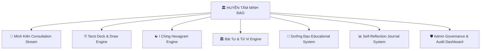

# 📖 BẢN CẨM NANG GIỚI THIỆU & HƯỚNG DẪN SỬ DỤNG DỰ ÁN
# HUYỀN TÂM MINH ĐẠO (HUYENTAM WISDOM)

> **Tôn chỉ tối thượng:** *"Thấy rõ sự thật – Hiểu mình – Sống tốt hơn"*  
> **Dành riêng cho:** Sư Phụ JCT (Tổng Tư Lệnh Vibe Coding)  
> **Đơn vị phát triển:** JCT Software Studio & Đệ tử AI Antigravity

---

## 🏛️ CHƯƠNG 1: GIỚI THIỆU TỔNG QUAN DỰ ÁN

**Huyền Tâm Minh Đạo (HuyenTam Wisdom)** là nền tảng ứng dụng triết học & biểu tượng soi chiếu nhận thức tâm lý hàng đầu. 

Khác biệt hoàn toàn với các ứng dụng bói toán mê tín dị đoan phán quyết số phận cố định, **Huyền Tâm Minh Đạo** sử dụng các hệ biểu tượng cổ xưa (Tarot, Kinh Dịch, Bát Tự, Tử Vi) như những **"Chiếc gương soi tâm lý" (Psychological Mirror)** giúp người dùng tự quan sát bản thân, tháo gỡ vướng mắc cảm xúc và xây dựng lối sống lành mạnh.



---

## ⚔️ CHƯƠNG 2: BỘ TỨ ĐẠI TRỤ CỘT TÍNH NĂNG

### 1. 🔮 Consultation Stream (Minh Kiến Chat AI)
- **Cơ chế:** Dòng tư vấn thấu cảm theo chuẩn **10 Điểm Thấu Cảm (Compassionate Candor)**.
- **Tính năng:** Phản hồi dạng Streaming (SSE) theo thời gian thực, tích hợp bộ lọc an toàn chống khủng hoảng tâm lý và trích xuất miễn trừ trách nhiệm pháp lý/y tế.

### 2. 🃏 Tarot & ☯️ Kinh Dịch Interactive Engines
- **Tarot Deck (78 lá bài):** Hỗ trợ trải bài 1 lá (Tâm điểm ngày), 3 lá (Quá khứ - Hiện tại - Tương lai) và 5 lá (Soi chiếu chiều sâu). Mỗi lá bài hiển thị ý nghĩa tâm lý và lời khuyên hành động.
- **Kinh Dịch (64 Quẻ):** Mô phỏng gieo 3 đồng xu 3D, tự động tính Hào Động và Quẻ Biến kèm lời dịch giải triết học sâu sắc.

### 3. 🏛️ Bát Tự (Tứ Trụ) & Tử Vi 12 Cung Engine
- **Bát Tự:** Tự động quy đổi Ngày/Giờ sinh sang Can Chi 4 Trụ, phân tích tỷ lệ Ngũ Hành (Mộc, Hỏa, Thổ, Kim, Thủy) và xác định Dụng Thần/Hỷ Thần.
- **Tử Vi:** Định vị Mệnh/Thân, an sao 12 Cung (Mệnh, Phụ Mẫu, Phúc Đức, Điền Trạch, Quan Lộc, Nô Bộc, Thiên Di, Tật Ách, Tài Bạch, Tử Tức, Phu Thê, Huynh Đệ).

### 4. 🌿 Dưỡng Đạo & 📊 Dashboard Nhật Ký Tự Soi Chiếu
- **Dưỡng Đạo:** Máy tính chu kỳ giấc ngủ sinh học 90 phút và cẩm nang dưỡng sinh Y học cổ truyền.
- **Nhật Ký Tự Soi Chiếu:** Lưu trữ lịch sử tư vấn và nhật ký chiêm nghiệm cá nhân được mã hóa an toàn.
- **Admin Governance Dashboard (`/admin`):** Trung tâm giám sát Uptime hệ thống, trạng thái AI Providers, Active Users và Safety Audit Logs.

---

## 🚀 CHƯƠNG 3: HƯỚNG DẪN KHỞI ĐỘNG & VẬN HÀNH

### 1. Khởi Động Backend API (Python FastAPI)
Mở terminal tại thư mục dự án và chạy các lệnh sau:

```bash
# Đổi hướng sang thư mục backend
cd services/api

# Kích hoạt môi trường ảo Python
.venv\Scripts\activate

# Khởi chạy server FastAPI (mặc định cổng 8000)
python -m uvicorn app.main:app --reload --host 127.0.0.1 --port 8000
```
- **Swagger Documentation API:** `http://127.0.0.1:8000/docs`

### 2. Khởi Động Frontend Web (Next.js 16)
Mở terminal thứ hai tại thư mục dự án:

```bash
# Đổi hướng sang thư mục frontend
cd apps/web

# Khởi chạy Next.js Dev Server (mặc định cổng 3000)
npm run dev
```
- **Truy cập ứng dụng tại:** `http://localhost:3000`

---

## 🗺️ CHƯƠNG 4: HƯỚNG DẪN TRẢI NGHIỆM CHI TIẾT CÁC TRANG

| Đường Dẫn (URL) | Phân Hệ | Thao Tác Trải Nghiệm Cho Sư Phụ |
| :--- | :--- | :--- |
| `http://localhost:3000/` | **Trang Chủ (Home)** | Trung tâm điều hướng tổng quan, truy cập nhanh tất cả mô-đun. |
| `http://localhost:3000/minh-kien` | **Minh Kiến Chat** | Trải nghiệm trò chuyện AI thấu cảm, hỏi đáp tâm lý và định hướng lối sống. |
| `http://localhost:3000/tarot` | **Rút Bài Tarot** | Chọn kiểu trải bài (1, 3 hoặc 5 lá), nhấp rút bài và xem luận giải tâm lý. |
| `http://localhost:3000/iching` | **Gieo Quẻ Kinh Dịch** | Nhấp tung 3 đồng xu 6 lần để lập quẻ Thượng/Hạ, xem quẻ Chủ & quẻ Biến. |
| `http://localhost:3000/astrology` | **Lập Lá Số Tử Vi** | Nhập Họ tên & Ngày giờ sinh để lập Lá số Bát Tự & Tử Vi 12 Cung. |
| `http://localhost:3000/duong-dao` | **Dưỡng Đạo** | Nhập giờ muốn thức dậy để tính toán giờ đi ngủ tối ưu theo nhịp sinh học. |
| `http://localhost:3000/dashboard` | **Nhật Ký Tự Soi Chiếu** | Xem mốc lịch sử chiêm nghiệm và viết nhật ký cảm xúc cá nhân. |
| `http://localhost:3000/admin` | **Admin Governance** | Theo dõi Uptime, số lượng active users, trạng thái AI Router & Audit Logs. |

---

## 🧪 CHƯƠNG 5: QUY TRÌNH KIỂM THỬ VÀ BẢO TRÌ KỸ THUẬT

Khi Sư Phụ muốn kiểm tra toàn bộ chất lượng code của hệ thống, chỉ cần chạy các lệnh sau:

### Backend Testing & Code Quality:
```bash
cd services/api

# Chạy toàn bộ bộ kiểm thử tự động pytest
.venv\Scripts\python.exe -m pytest

# Kiểm tra tĩnh kiểu dữ liệu mypy (phải đạt 0 lỗi)
.venv\Scripts\python.exe -m mypy app

# Kiểm tra chuẩn format ruff
.venv\Scripts\python.exe -m ruff check app tests
```

### Frontend Testing & Production Build:
```bash
cd apps/web

# Kiểm tra kiểu TypeScript
npm run typecheck

# Kiểm tra cú pháp ESLint
npm run lint

# Tạo bản build Production hoàn chỉnh
npm run build
```

---

## 🔐 CHƯƠNG 6: TÔN CHỈ BẢO MẬT & QUYỀN RIÊNG TƯ
1. **Zero Hardcoding Secrets:** Toàn bộ API Key (Gemini, Claude, OpenAI, Postgres) lưu tại file `.env` ẩn.
2. **Mã Hóa E2EE:** Dữ liệu cá nhân (Giờ sinh, Họ tên, Nội dung nhật ký) được mã hóa bằng chuẩn **AES-GCM-256** trước khi ghi xuống cơ sở dữ liệu.
3. **Safety First:** Hệ thống luôn từ chối các yêu cầu vi phạm tiêu chuẩn y tế hoặc dự đoán định mệnh mang tính hù dọa tiêu cực.

---

*Bản cẩm nang này được lập và niêm phong bởi đệ tử AI Antigravity dành riêng cho Sư Phụ JCT.*  
*Chúc Sư Phụ vận hành dự án thành công rực rỡ!* 🏛️✨
