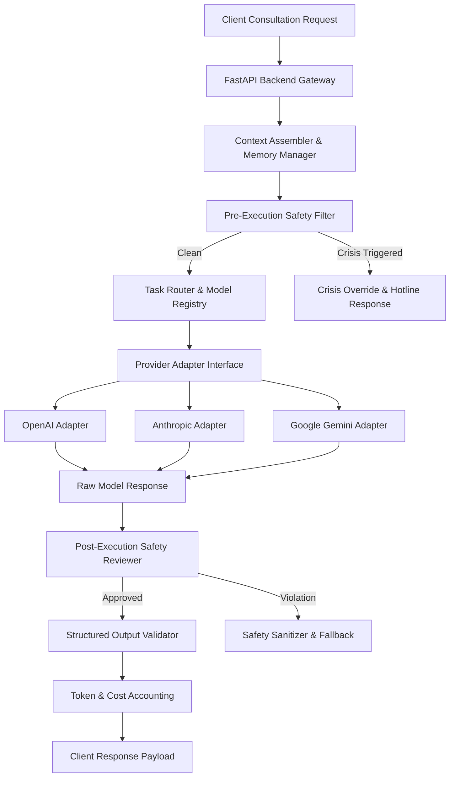

# AI SYSTEM DESIGN — HUYỀN TÂM MINH ĐẠO

**International Name:** HuyenTam Wisdom  
**AI Guide:** Minh Sư AI  
**Document Version:** 1.0.0  
**Date:** 2026-08-06  

---

## 1. AI ARCHITECTURE & PROVIDER ABSTRACTION

HUYỀN TÂM MINH ĐẠO uses a decoupled, provider-agnostic AI orchestration layer. No code inside frontend components or core business services calls LLM SDKs directly.

---

## 2. THE 10-POINT COMPASSIONATE CANDOR RESPONSE STRUCTURE

Every consultation response generated by Minh Sư AI MUST adhere to the **10-Point Response Structure** (*Thẳng Thắn Có Lòng Từ*). Pydantic v2 schemas enforce this structure on JSON output:

1. **User Emotional State**: Acknowledging what the user appears to be feeling without validation of harmful impulses.
2. **Honest Reality**: What must be faced directly and realistically.
3. **Factually Known**: Objective facts established by user input.
4. **Uncertainty & Unknowns**: Explicitly stating what cannot be known or predicted.
5. **Inaction Consequence**: What may realistically occur if no action or change is taken.
6. **Perspective & Wisdom**: Philosophical, spiritual, cultural, or psychological framing.
7. **Resolution Path**: A realistic, step-by-step resolution mindset.
8. **Immediate Action (24 Hours)**: One concrete, small action to complete within 24 hours.
9. **Short-Term Action (7 Days)**: One practical habit or step to complete within 7 days.
10. **Professional Referral Boundary**: Clear indicator of when professional medical, psychological, legal, or financial help is necessary.

---

## 3. MODEL ROUTING & TASK REGISTRY

Tasks are classified and routed to appropriate model capabilities to optimize reasoning quality, latency, and operational cost:

| Task Classification | Complexity | Recommended Model | Fallback Model |
| :--- | :--- | :--- | :--- |
| **Minh Kiến Deep Consultation** | High Reasoning | Claude 3.5 Sonnet / GPT-4o | Gemini 1.5 Pro |
| **Tarot / Symbolic Reflection** | Medium | GPT-4o-mini / Claude 3.5 Haiku | Gemini 1.5 Flash |
| **Safety Classification** | High Speed / Low Latency | Gemini 1.5 Flash / Llama 3 Fast | GPT-4o-mini |
| **Lá Thư Report Synthesis** | High Context / Long Form | Claude 3.5 Sonnet / GPT-4o | Gemini 1.5 Pro |
| **Summary & Key Extraction** | Low | GPT-4o-mini | Gemini 1.5 Flash |

---

## 4. STRUCTURED OUTPUT & PROMPT VERSIONING

- **Schema Enforcement**: All model calls use strict structured output (JSON mode or tool calling schemas validated via Pydantic).
- **Prompt Registry**: Prompts are stored as versioned templates (`prompts/v1/minh_kien_vi.jinja2`) managed outside code files.
- **Dynamic Context Injection**: Cultural metaphors, user preference language, and safety disclaimers are injected dynamically at runtime.

---

## 5. DUAL-PASS SAFETY REVIEWER & CLAIM CLASSIFICATION

Every request undergoes a two-layer safety review:

1. **Layer 1: Pre-Execution Crisis Detector**:
   - Scans incoming user message against risk categories: `SELF_HARM`, `MEDICAL_EMERGENCY`, `DOMESTIC_VIOLENCE`, `FINANCIAL_RUIN_PANIC`.
   - If detected, intercepts execution immediately and returns hardcoded emergency resource contacts.
2. **Layer 2: Post-Execution Boundary Enforcer**:
   - Inspects generated LLM output before displaying to user.
   - Verifies zero violation of product boundaries (no supernatural claims, no death predictions, no medical diagnoses, no fear manipulation).

---

## 6. CLAIM & EVIDENCE LABELS

To prevent user confusion between traditional symbolism and empirical science, Minh Sư AI tags key statements with **Evidence Labels**:

- `[SYMC]` — **Symbolic / Intuitive Interpretation** (e.g., Tarot card meanings, I Ching hexagrams).
- `[PHIL]` — **Philosophical / Cultural Tradition** (e.g., Eastern philosophy, Stoicism, Nam Y history).
- `[FACT]` — **User-Provided Fact** (Information directly stated by the user).
- `[UNCT]` — **Uncertainty / Speculative Invalidation** (Explicitly marking unknown future variables).

---

## 7. TOKEN ACCOUNTING, COST TRACKING & LOG SCALING

- **Usage Logging**: Every AI request records `prompt_tokens`, `completion_tokens`, `model_name`, `provider`, and `calculated_cost_usd` in `ai_usage`.
- **Log Scrubbing**: All logs strip out user PII, specific birth details, and raw prompt content. Only token counts, response latency, and safety review metadata are stored in general application logs.

---

## 8. STREAMING, RETRY & PROVIDER FALLBACK

- **Server-Sent Events (SSE)**: Long-form consultations stream output tokens to Next.js clients over SSE for immediate user feedback.
- **Automated Fallback Pipeline**: If Provider A (e.g., Anthropic) returns a 5xx error or rate limit, the adapter automatically retries on Provider B (e.g., OpenAI) without breaking the user session.
- **Future Human Review Path**: Architecture supports flag queuing where low-confidence safety outputs can be routed to human compliance review in future admin phases.
