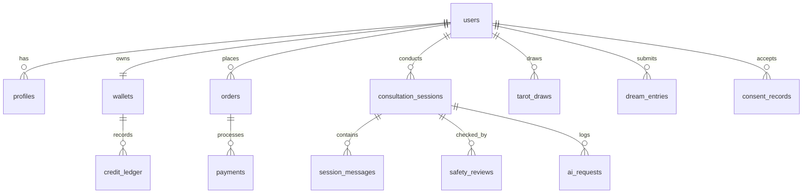

# DATABASE DESIGN — HUYỀN TÂM MINH ĐẠO

**International Name:** HuyenTam Wisdom  
**Document Version:** 1.0.0  
**Date:** 2026-08-06  

---

## 1. DESIGN PRINCIPLES & GUIDELINES

1. **Strict Data Isolation & Encryption**: Sensitive user profile fields (birth date/time, personal reflections) are encrypted at rest using AES-256.
2. **Immutable Audit & Financial Records**: Financial ledgers (`credit_ledger`), payment logs, and audit logs are append-only. Deletions or updates to ledger entries are strictly forbidden at the database trigger level.
3. **GDPR / Privacy Compliance**: Deletion of a user account triggers anonymization of relational records rather than physical deletion of historical financial transactions (to satisfy statutory tax and financial reporting requirements).

---

## 2. ENTITY SCHEMA SPECIFICATION

Below is the conceptual entity schema for HUYỀN TÂM MINH ĐẠO across core domain modules.

### 2.1 Identity, Users & RBAC

#### `users`
- **Purpose**: Core user account authentication record.
- **Fields**: `id` (UUID, PK), `email` (VARCHAR, Unique), `password_hash` (VARCHAR), `is_active` (BOOL), `is_verified` (BOOL), `created_at` (TIMESTAMPTZ), `updated_at` (TIMESTAMPTZ).
- **Sensitive Fields**: `email`, `password_hash`.
- **Deletion Rule**: Soft delete or anonymization.

#### `profiles`
- **Purpose**: Extended user profile including birth details used for symbolic reflection.
- **Fields**: `id` (UUID, PK), `user_id` (UUID, FK -> users.id), `full_name` (VARCHAR), `preferred_name` (VARCHAR), `locale` (VARCHAR, default 'vi'), `birth_date` (BYTEA, Encrypted), `birth_time` (BYTEA, Encrypted), `birth_location` (BYTEA, Encrypted), `gender_identity` (VARCHAR), `created_at` (TIMESTAMPTZ).
- **Sensitive Fields**: `birth_date`, `birth_time`, `birth_location`.

#### `roles` & `permissions` & `user_roles`
- **Purpose**: Role-Based Access Control (RBAC) supporting roles such as `user`, `editor`, `compliance_auditor`, `admin`, `system_superadmin`.
- **Relationships**: Many-to-Many between `users` and `roles`.

---

### 2.2 Wallets, Products & Financial Ledger

#### `products` & `prices`
- **Purpose**: Catalog of credit top-up packages ("Linh Điểm"), report purchases, and subscription plans.
- **Fields**: `id` (UUID, PK), `name` (JSONB - vi/en), `sku` (VARCHAR, Unique), `credit_amount` (INT), `price_amount` (NUMERIC), `currency` (VARCHAR), `is_active` (BOOL).

#### `wallets`
- **Purpose**: Current credit balance snapshot per user.
- **Fields**: `id` (UUID, PK), `user_id` (UUID, FK -> users.id, Unique), `cached_balance` (INT), `last_reconciled_at` (TIMESTAMPTZ).
- **Audit Rule**: Must be reconcilable against `credit_ledger`.

#### `credit_ledger` (IMMUTABLE)
- **Purpose**: Append-only transaction ledger recording all credit top-ups, spends, promotional grants, and refunds.
- **Fields**: `id` (UUID, PK), `wallet_id` (UUID, FK -> wallets.id), `user_id` (UUID, FK -> users.id), `transaction_type` (ENUM: TOPUP, SPEND, PROMO, REFUND, TIP), `amount` (INT), `balance_after` (INT), `reference_id` (VARCHAR), `idempotency_key` (VARCHAR, Unique), `created_at` (TIMESTAMPTZ).
- **Immutable**: Yes. Triggers block `UPDATE` or `DELETE`.

#### `orders`, `payments`, `subscriptions`, `coupons`, `tips`
- **Purpose**: Order management, payment gateway transaction tracking, subscription status, promotional coupons, and voluntary gratitude tips.
- **Rule**: `tips` must be linked to `consultation_sessions` but carry zero logic altering session output.

---

### 2.3 Minh Đạo Core (Sessions, Tarot & AI Interpretations)

#### `services`
- **Purpose**: Service catalog (e.g., Minh Kiến Life Consultation, Tarot Reflection, Dream Interpretation).

#### `consultation_sessions` & `session_messages`
- **Purpose**: Tracks active and historical consultation sessions between users and Minh Sư AI.
- **Fields (`consultation_sessions`)**: `id` (UUID, PK), `user_id` (UUID, FK), `service_id` (UUID, FK), `status` (ENUM: ACTIVE, COMPLETED, SUSPENDED_SAFETY), `created_at` (TIMESTAMPTZ).
- **Fields (`session_messages`)**: `id` (UUID, PK), `session_id` (UUID, FK), `sender_type` (ENUM: USER, AI, SYSTEM), `content` (TEXT), `point_structure_meta` (JSONB), `created_at` (TIMESTAMPTZ).

#### `tarot_decks`, `tarot_cards`, `tarot_draws`
- **Purpose**: Cards library, decks, and individual user card draw sessions.
- **Note**: Card meanings are framed as psychological mirrors, not fatalistic fortune telling.

#### `dream_entries` & `interpretations`
- **Purpose**: User dream notes and AI symbolic reflection outputs.

---

### 2.4 AI Safety, Observability & Accounting

#### `safety_reviews`
- **Purpose**: Logs all safety evaluations conducted by the dual-pass Safety Reviewer.
- **Fields**: `id` (UUID, PK), `session_id` (UUID, FK), `flagged` (BOOL), `risk_category` (VARCHAR), `confidence_score` (FLOAT), `action_taken` (ENUM: ALLOW, REWRITE, OVERRIDE_CRISIS), `created_at` (TIMESTAMPTZ).

#### `ai_requests` & `ai_usage`
- **Purpose**: Tracks model provider requests, prompt tokens, completion tokens, model name, response latency, and calculated USD cost for operational tracking.

#### `reports` ("Lá Thư Huyền Tâm")
- **Purpose**: Generated PDF/Web reports synthesizing multi-session guidance.

---

### 2.5 Knowledge Base, Health Boundaries & Dưỡng Đạo

#### `knowledge_traditions`, `source_documents`, `evidence_labels`
- **Purpose**: Knowledge sources for Nam Y, TCM history, Ayurveda, and philosophy. `evidence_labels` classify sources (e.g., `HISTORICAL_TEXT`, `FOLK_BELIEF`, `MODERN_LIFESTYLE_RESEARCH`).

#### `health_claims`, `risk_flags`
- **Purpose**: Strict dictionary of banned health diagnosis terms and disallowed medical claims.

#### `wellness_plans` & `daily_guidance_entries`
- **Purpose**: Educational lifestyle guidance notes (sleep, hydration, movement) with attached mandatory health disclaimers.

---

### 2.6 Privacy, Consent & Audit

#### `consent_records`
- **Purpose**: Legal record of user consent for terms of service, privacy policy, AI content disclosure, and health disclaimers.

#### `audit_logs` (IMMUTABLE)
- **Purpose**: Administrative action logs (role changes, system settings edits, data access).

#### `system_settings`
- **Purpose**: Key-value runtime settings (feature flags, default credit pricing, active model router settings).

---

## 3. ENTITY RELATIONSHIP SUMMARY

