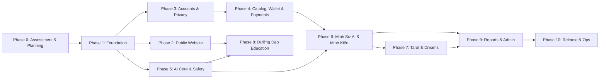

# IMPLEMENTATION ROADMAP — HUYỀN TÂM MINH ĐẠO

**International Name:** HuyenTam Wisdom  
**Document Version:** 1.0.0  
**Date:** 2026-08-06  

---

## 1. ROADMAP OVERVIEW & EXECUTION STRATEGY

The implementation of HUYỀN TÂM MINH ĐẠO is structured into 11 phased iterations (Phase 0 through Phase 10). Each phase represents a self-contained engineering milestone with strict dependencies, clear exit criteria, and explicit risk controls.

> [!NOTE]
> Complexity estimates use standard size metrics: **Small (S)**, **Medium (M)**, **Large (L)**, and **Extra Large (XL)**. In compliance with project guidelines, no calendar time commitments or fixed deadlines are declared.

---

## 2. PHASED ROADMAP SPECIFICATION

---

### Phase 0: Assessment & Planning (CURRENT PHASE)
- **Objective**: Conduct repository inspection, define architecture, safety policies, database schemas, risk registers, and task backlogs.
- **Dependencies**: None.
- **Deliverables**: Complete documentation suite (`ANTIGRAVITY_MASTER_PROMPT.md`, `docs/*.md`).
- **Risks**: Scope creep or implementing features prematurely without user review.
- **Exit Criteria**: All 14 required Phase 0 documents created, validated, and approved by project owner.
- **Complexity**: **Medium (M)**

---

### Phase 1: Foundation Setup
- **Objective**: Establish production repository setup, Next.js frontend, FastAPI backend, PostgreSQL/Redis local containers, shared environment configuration, and CI linting pipelines.
- **Dependencies**: Phase 0 completion.
- **Deliverables**: Functional local dev environment, healthcheck endpoints, DB connection, base test suites.
- **Risks**: Environment mismatches, configuration errors.
- **Exit Criteria**: Pass all items in `docs/PHASE_1_DEFINITION_OF_DONE.md`.
- **Complexity**: **Medium (M)**

---

### Phase 2: Public Website & Design System
- **Objective**: Build responsive public landing pages, brand identity, navigation, hero sections, and multilingual localization support (`next-intl`).
- **Dependencies**: Phase 1.
- **Deliverables**: Public layout, homepage, locale switcher (vi/en), accessibility baseline.
- **Risks**: Mobile responsiveness flaws, missing i18n translations.
- **Exit Criteria**: Clean UI rendering on desktop and mobile viewports with zero i18n missing key errors.
- **Complexity**: **Medium (M)**

---

### Phase 3: Accounts, Auth & Privacy Baseline
- **Objective**: Implement user registration, email login, Supabase Auth integration, encrypted profile storage, consent management, and account deletion endpoints.
- **Dependencies**: Phase 1.
- **Deliverables**: User auth API, encrypted birth data schema, consent log table, session management.
- **Risks**: Insecure auth tokens, unencrypted PII storage.
- **Exit Criteria**: Secure auth flow verified by integration tests; encrypted field verification.
- **Complexity**: **Large (L)**

---

### Phase 4: Product Catalog, Wallet & Payments
- **Objective**: Build credit ledger ("Linh Điểm"), wallet snapshot tables, credit top-up packages, mock/Stripe payment gateway integration, and webhook security.
- **Dependencies**: Phase 3.
- **Deliverables**: `credit_ledger` engine, wallet API endpoints, webhook handler with signature validation & idempotency.
- **Risks**: Double-crediting bugs, race conditions in wallet calculations.
- **Exit Criteria**: Automated tests pass for concurrent balance operations and duplicate webhook replays.
- **Complexity**: **Extra Large (XL)**

---

### Phase 5: AI Core & Safety Pipeline
- **Objective**: Build provider-independent AI adapter layer, task router, prompt registry, and dual-pass Safety Reviewer with crisis override protocol.
- **Dependencies**: Phase 1.
- **Deliverables**: `BaseAIProvider`, OpenAI/Anthropic/Gemini adapters, pre/post safety enforcers, token cost tracking.
- **Risks**: Safety filter bypass, provider outages.
- **Exit Criteria**: 100% pass rate on safety regression test suite (50+ test prompts).
- **Complexity**: **Extra Large (XL)**

---

### Phase 6: Minh Sư AI & Minh Kiến Consultation
- **Objective**: Implement interactive Minh Kiến sessions featuring the 10-point Compassionate Candor response structure, streaming responses, and credit deduction.
- **Dependencies**: Phase 4, Phase 5.
- **Deliverables**: `/sessions` backend endpoints, real-time SSE streaming UI, structured consultation view.
- **Risks**: Context overflow, token cost explosion.
- **Exit Criteria**: End-to-end user session execution with credit deduction and valid 10-point output.
- **Complexity**: **Large (L)**

---

### Phase 7: Tarot & Dream Interpretation
- **Objective**: Implement Tarot deck library, card draw mechanics, dream journal entry forms, and AI symbolic reflection engines.
- **Dependencies**: Phase 6.
- **Deliverables**: Interactive Tarot UI, card draw API, symbolic interpretation engine with Evidence Labels (`[SYMC]`).
- **Risks**: Misinterpreting Tarot as fatalistic fortune-telling.
- **Exit Criteria**: All Tarot outputs display psychological mirror disclaimers and Evidence Labels.
- **Complexity**: **Medium (M)**

---

### Phase 8: Dưỡng Đạo Lifestyle Education
- **Objective**: Implement educational lifestyle section covering sleep, rest, hydration, Nam Y history, and seasonal rhythms with health boundary checks.
- **Dependencies**: Phase 2, Phase 5.
- **Deliverables**: Knowledge base UI, content rendering engine, medical disclaimer component.
- **Risks**: Accidental medical diagnosis or prescription wording.
- **Exit Criteria**: Zero diagnostic terms in content; mandatory disclaimers rendered on all entries.
- **Complexity**: **Medium (M)**

---

### Phase 9: Personalized Reports & Admin Dashboard
- **Objective**: Build "Lá Thư Huyền Tâm" PDF generation engine and internal admin dashboard for RBAC management, audit log inspection, and safety monitoring.
- **Dependencies**: Phase 6, Phase 7.
- **Deliverables**: Asynchronous PDF report generator, `/admin` dashboard, audit log viewer.
- **Risks**: Admin PII leaks, PDF layout rendering bugs.
- **Exit Criteria**: PDF generation verified; admin RBAC enforced with audit logs.
- **Complexity**: **Large (L)**

---

### Phase 10: Operational Release & Monitoring
- **Objective**: Production deployment pipeline, Cloudflare WAF setup, automated error monitoring (Sentry), performance tuning, and final security audit.
- **Dependencies**: Phase 9.
- **Deliverables**: Production deployment configs, monitoring dashboards, incident response plan.
- **Risks**: Production downtime, unmonitored errors.
- **Exit Criteria**: Production readiness verification; successful load and security audit.
- **Complexity**: **Medium (M)**
