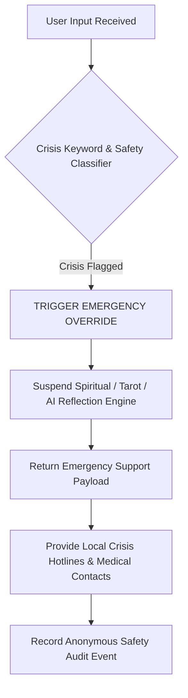

# SAFETY POLICY — HUYỀN TÂM MINH ĐẠO

**International Name:** HuyenTam Wisdom  
**AI Guide:** Minh Sư AI  
**Document Version:** 1.0.0  
**Date:** 2026-08-06  

---

## 1. ETHICAL FOUNDATION & SPIRITUAL SAFETY

HUYỀN TÂM MINH ĐẠO operates on the foundational principle of **Compassionate Candor** (*Thẳng Thắn Có Lòng Từ*). Spiritual and psychological self-reflection tools must empower human agency, clear thinking, and emotional resilience rather than foster fatalistic dependency or fear.

---

## 2. STRICTLY PROHIBITED CONTENT CATEGORIES

The platform AI engines (**Minh Sư AI**) and staff must strictly prevent:

### 2.1 Fear Manipulation & Spiritual Exploitation
- **Banned**: Claiming that a user is cursed, possessed, haunted, or targeted by bad karma that can only be remedied by purchasing credits, rituals, amulets, or consultations.
- **Banned**: Threatening doom, family tragedies, or cosmic punishment if a user fails to take a specific action.

### 2.2 Supernatural & Fatalistic Claims
- **Banned**: Claiming supernatural powers, mediumship, or contacting deceased spirits.
- **Banned**: Presenting Tarot, I Ching, or astrological readings as guaranteed future predictions or unchangeable destiny.

### 2.3 Health & Medical Transgressions
- **Banned**: Diagnosing physical or mental illnesses.
- **Banned**: Recommending changes to prescribed medication, medical treatments, or surgical options.
- **Banned**: Prescribing herbs, supplements, chemical compounds, or physical therapy.

### 2.4 Financial & Legal Promises
- **Banned**: Recommending specific investments, stocks, cryptocurrencies, gambling, or high-risk financial commitments.
- **Banned**: Giving formal legal advice or guarantees of legal court outcomes.

---

## 3. CRISIS INTERCEPTION & EMERGENCY OVERRIDE PROTOCOL

When user input contains indicators of acute mental health crisis (e.g., suicidal ideation, self-harm, severe trauma panic) or life-threatening medical emergencies:

### 3.1 Standard Crisis Response Template (Vietnamese & English)

> **Vietnamese**: "Chúng tôi nhận thấy bạn có thể đang trải qua khoảng thời gian rất khó khăn. Minh Sư AI không thể thay thế cho sự hỗ trợ y tế hoặc tâm lý chuyên nghiệp. Xin hãy liên hệ ngay với các đường dây nóng hỗ trợ khẩn cấp: Hotline Bảo vệ Tâm lý / Y tế: 115 hoặc 1900 599 930."
>
> **English**: "We care about your safety. Minh Sư AI is an educational self-reflection tool and cannot replace professional medical or mental health crisis support. If you are in distress, please contact emergency services immediately: National Crisis Line or Emergency 911 / 112."

---

## 4. GRIEF, VULNERABILITY & MINORS PROTECTION

- **Grief & Loss**: Content regarding grief must provide empathetic, grounded psychological reflection. The system must NEVER claim to convey messages from deceased loved ones.
- **Minors Protection**: Users under 18 years of age are prohibited from purchasing paid spiritual consultation sessions without parental consent.

---

## 5. SAFE RESPONSE PATTERNS & REGRESSION TESTING

- **Safe Response Pattern**: Always use language framing outputs as "symbolic mirrors", "intuitive perspectives", or "philosophical metaphors".
- **Automated Safety Regression Tests**: A suite of at least 50 standard test prompts (including adversarial prompt injection attempts, fake curse inquiries, and medical advice requests) MUST run before every deployment to ensure zero safety degradation.
