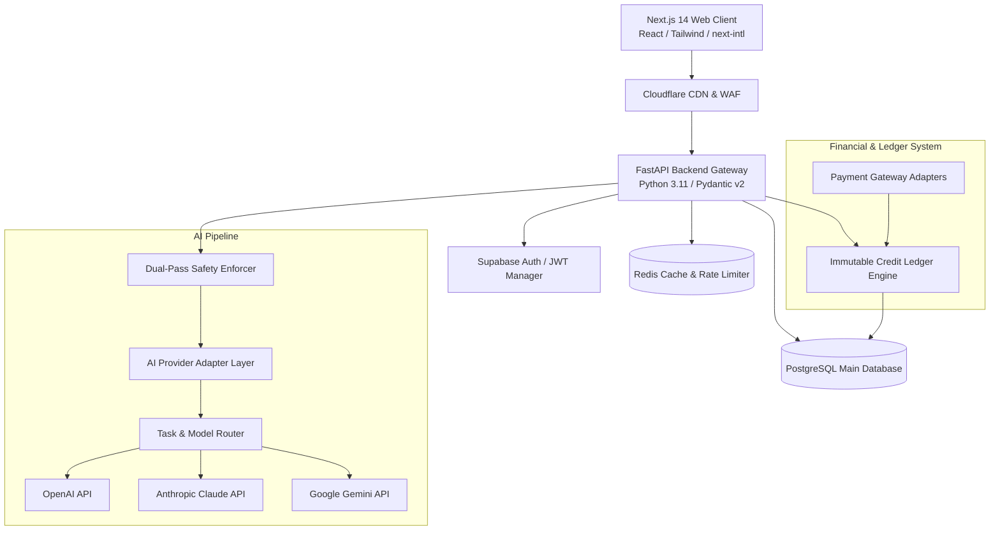
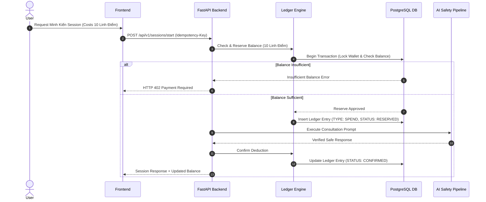
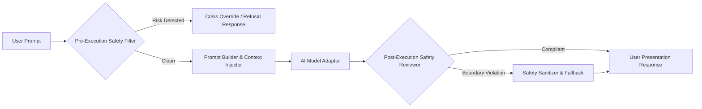

# SYSTEM ARCHITECTURE — HUYỀN TÂM MINH ĐẠO

**International Name:** HuyenTam Wisdom  
**Document Version:** 1.0.0  
**Date:** 2026-08-06  

---

## 1. HIGH-LEVEL ARCHITECTURE OVERVIEW

HUYỀN TÂM MINH ĐẠO adopts a modern, decoupled client-server architecture designed for high performance, strict safety controls, provider-agnostic AI orchestration, and financial auditability.

---

## 2. FRONTEND ARCHITECTURE & BOUNDARIES

- **Framework**: Next.js 14+ (App Router architecture).
- **Language**: TypeScript with strict mode enabled (`noImplicitAny`, `strictNullChecks`).
- **Styling & UI**: Tailwind CSS for responsive design, shadcn/ui component library, Framer Motion for subtle micro-animations.
- **Form Handling & Validation**: React Hook Form paired with Zod schemas.
- **Internationalization**: `next-intl` providing seamless Vietnamese (`vi`) and English (`en`) locale switching.
- **State Management**: React Context / Zustand for lightweight local state (wallet balance, active session state). No direct backend database calls from client components.

---

## 3. BACKEND ARCHITECTURE & BOUNDARIES

- **Framework**: FastAPI (Python 3.11+) offering high-performance asynchronous request handling.
- **Data Validation & Serialisation**: Pydantic v2 schemas across all API endpoints.
- **ORM & Migrations**: SQLAlchemy 2.0 (AsyncIO engine) with Alembic for version-controlled database migrations.
- **Caching & Queue**: Redis for fast session storage, API rate limiting, and prompt caching.
- **API Design**: RESTful API design under `/api/v1/` with OpenAPI / Swagger documentation.

---

## 4. DATABASE & CREDIT LEDGER ARCHITECTURE

- **Main Storage**: PostgreSQL 15+ hosted on managed infrastructure.
- **Immutable Credit Ledger ("Linh Điểm")**:
  - Wallet balances are computed or verified against an append-only transaction ledger table (`credit_ledger`).
  - No direct `UPDATE wallet SET balance = balance - X` without recording an immutable transaction record.
  - Transactions use unique idempotency keys to prevent double-charging or duplicate credit grants.

---

## 5. AI PROVIDER & SAFETY PIPELINE ARCHITECTURE

- **Provider-Independent Adapter Layer**: Abstract base class (`BaseAIProvider`) supporting multiple LLM backends (OpenAI, Anthropic Claude, Google Gemini).
- **Task & Model Routing**: Routes lightweight tasks (claim classification, summary generation) to fast models and complex philosophical consultations to high-reasoning models.
- **Dual-Pass Safety Pipeline**:
  1. **Pre-Execution Check**: Inspects incoming user prompts for self-harm, medical emergency keywords, or malicious prompt injection.
  2. **Post-Execution Enforcer**: Inspects raw AI outputs to verify adherence to "Compassionate Candor" and ensure no supernatural claims, medical diagnoses, or fear manipulation exist.

---

## 6. PAYMENT ARCHITECTURE & WEBHOOK SECURITY

- **Supported Payment Gateway Adapters**: Stripe (International) and Local Payment Adapters (MoMo / VNPay / Bank Transfer).
- **Server-Side Validation**: All financial transactions originate and validate on the backend.
- **Webhook Security**:
  - Mandatory HMAC-SHA256 signature verification on incoming payment webhooks.
  - Idempotency processing: Webhook events are checked against `processed_webhooks` table prior to credit execution.
  - Replay attack mitigation: Strict timestamp checks on incoming payload signatures.

---

## 7. REPORT GENERATION ARCHITECTURE ("Lá Thư Huyền Tâm")

- **Synthesis Process**: Asynchronous background generation combining consultation history, user goals, and structured guidance.
- **Output Formats**: Interactive HTML view in client dashboard and downloadable PDF generated via Python PDF engine (e.g., WeasyPrint / ReportLab).
- **Storage**: Generated PDFs stored in Cloudflare R2 or Supabase Storage with signed short-lived download URLs.

---

## 8. OBSERVABILITY & MONITORING

- **Centralized Structured Logging**: JSON-formatted logs with automatic scrubbing of PII, credit card data, birth records, and prompt text.
- **Performance Metrics**: API response latency, AI token usage per provider, credit transaction volume, safety filter triggers.
- **Error Tracking**: Integration readiness for Sentry or OpenTelemetry.
